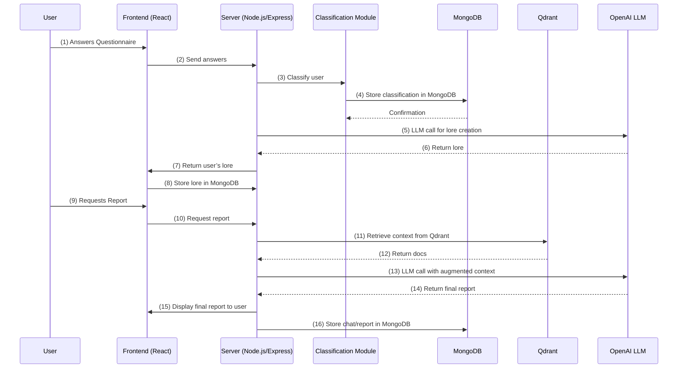

# rwaAgent Technical Documentation

## 1. Introduction

**Name**: rwaAgent (Placeholder)  
**Version**: 0.1 (Draft)

**Description**:  
rwaAgent is a standalone Retrieval-Augmented Generation (RAG) chatbot focused on generating insightful, personalized reports for users in the blockchain industry—particularly those interested in Real World Assets (RWA) or other crypto-related initiatives. The solution leverages large language models, a specialized knowledge base, and a classification module to determine a user’s crypto profile and produce unique “lore” narratives alongside data-driven insights.

---

## 2. Architecture Overview

### 2.1 High-Level Diagram

```mermaid
flowchart LR
    A((User)) --> B[Web UI (React)]
    B --> C[rwaAgent (RAG)]
    C --> D[(OpenAI LLM)]
    C --> E[(Qdrant)]
    C --> F[(MongoDB)]
```

1. **User** interacts via the **Web UI** (React) on the MERN stack.  
2. **rwaAgent** orchestrates classification, lore generation, context retrieval via Qdrant, and LLM calls via OpenAI.  
3. **MongoDB** stores user chat histories, classification results, and authentication data.  
4. **Qdrant** provides vector-based retrieval of relevant context from blockchain/RWA documents.

### 2.2 Core Components

1. **Frontend (React)**  
   - Presents a multi-step questionnaire to determine the user’s crypto profile.  
   - Displays both personalized lore and final reports.

2. **Backend (Node.js/Express)**  
   - Implements classification logic for user profiles.  
   - Interfaces with Qdrant for context retrieval and calls the OpenAI API for text generation.  
   - Stores user session data, classification results, and lore in MongoDB.

3. **Classification Module**  
   - Combines rule-based heuristics and LLM-based classification for crypto profile determination.  
   - Assigns user segments (e.g., “DeFi Enthusiast,” “RWA Investor,” etc.) based on questionnaire responses.  
   - Generates personalized metadata for lore generation.

4. **Lore Generation Subsystem**  
   - Utilizes the user’s profile metadata (e.g., “RWA Focused Investor”) to produce a unique “lore” or persona background.  
   - Employs LLM calls with specialized prompts so each user’s lore is distinct.

5. **Retrieval-Augmented Generation (RAG) Pipeline**  
   - Queries Qdrant for nearest-neighbor lookups on vector embeddings.  
   - Augments the LLM prompt with retrieved context, ensuring domain-specific and fact-based answers.

6. **OpenAI API**  
   - Provides the Large Language Model (LLM) for classification, lore creation, and final report generation.

7. **MongoDB**  
   - Houses user authentication data, chat logs, classification labels, and lore artifacts.

8. **Docker**  
   - Containerizes the stack for streamlined deployment and scalability.

### 2.3 Low-Level Diagram (Detailed Flow)



**Step-by-Step Explanation**:

1. The **User** completes a questionnaire on the **Frontend**.  
2. The **Frontend** sends the questionnaire data to the **Server**.  
3. The **Server** invokes the **Classification Module** to categorize the user’s crypto profile.  
4. The classification result is stored in **MongoDB**.  
5. The **Server** calls the **OpenAI LLM** to generate personalized “lore” using classification metadata.  
6. The LLM returns the generated lore to the **Server**.  
7. The **Server** sends the lore back to the **Frontend**, which displays it to the **User**.  
8. The lore is stored in **MongoDB** for future reference.  
9. The **User** requests a specialized report.  
10. The **Frontend** relays the request to the **Server**.  
11. The **Server** queries **Qdrant** for relevant vector-embedded documents.  
12. **Qdrant** returns the most relevant documents.  
13. The **Server** calls the **OpenAI LLM** again, appending the retrieved context to generate a domain-specific report.  
14. The LLM returns the final report.  
15. The **Server** forwards the report to the **Frontend**, which displays it to the **User**.  
16. The **Server** stores the user’s chat history and final report in **MongoDB**.

---

## 3. Installation and Deployment

### 3.1 Prerequisites

- **Operating System**: Linux or macOS recommended (Windows possible with Docker Desktop).  
- **Docker**: Ensure Docker is installed (version 20+ recommended).  
- **Node.js**: Version 23+ if running outside of Docker.  
- **Memory & CPU**:  
  - **Memory**: At least 8GB to run Node.js, Qdrant, and MongoDB concurrently.  
  - **CPU**: 4+ cores recommended for classification, retrieval, and LLM requests.  
  - **GPU**: Not required.  
- **OpenAI API Key**: Valid credentials for LLM calls.

### 3.2 Dependencies

- **Backend**: Node.js, Express, classification libraries (if used), npm packages.  
- **Frontend**: React (part of MERN stack).  
- **Databases**:  
  - **MongoDB** for user data  
  - **Qdrant** for vector-based retrieval  
- **LLM**: OpenAI API  
- **Docker**: For containerization

---

## 4. Usage

### 4.1 Web UI

- **Access**: Users navigate to the designated domain or subdomain hosting rwaAgent’s frontend.  
- **User Onboarding / Questionnaire**:  
  - The user is prompted with a series of questions regarding their crypto experience, investment preferences, and interest in RWAs.  
  - Responses feed into the classification module to determine the user’s “crypto profile.”  
- **Lore Display**:  
  - After classification, a personalized “lore” narrative is displayed, providing the user with a unique persona in the crypto ecosystem.  
- **Report Generation**:  
  - Users can request specialized reports (e.g., RWA market updates) tailored to their profile.  

---

## 5. Data Flow: RAG Chatbot + Classification

1. **User Questionnaire**  
   - User inputs answers about crypto experience, RWA knowledge, etc.  
   - A classification subroutine (rule-based, LLM-based, or hybrid) processes these inputs to produce a user segment (“NFT Collector,” “DeFi Specialist,” etc.).

2. **Lore Generation**  
   - Once classification is complete, a specialized “lore” prompt is constructed.  
   - The backend calls the OpenAI API with classification metadata to generate a unique persona or story for the user.

3. **RAG-Based Report Generation**  
   - When the user requests a report, the system queries Qdrant for relevant blockchain articles, RWA data, or domain-specific context.  
   - The retrieved context is appended to the LLM prompt, ensuring answers are grounded in domain-specific knowledge.  
   - The final text is returned to the user’s interface.

4. **Storage**  
   - **MongoDB** persists classification results, user lore, and chat histories.  
   - **Qdrant** stores vector embeddings for domain documents.

---

## 6. Security and Privacy

### 6.1 Data Handling

- **MongoDB**:  
  - Stores minimal user data (e.g., user ID, classification labels).  
  - Chat logs and lore narratives are stored to enable session continuity.  
- **Qdrant**:  
  - Maintains embeddings for domain-related documents; typically doesn’t store personal data.

### 6.2 Authentication

- **User Auth**:  
  - Email/password or OAuth-based login for accessing questionnaires and chat functionality.  
  - Tokens or sessions secured via HTTPS.

### 6.3 Compliance

- **GDPR/PII**:  
  - If personal data is stored, ensure users can request data deletion or export.  
- **Crypto Advice Disclaimer**:  
  - Communicate that rwaAgent is for informational purposes and not financial/legal advice.

---

## 7. Limitations and Known Issues

1. **Classification Generalization**:  
   - The classification model may misclassify atypical users without sufficient training data.  
2. **Token/Context Limits**:  
   - Large documents might need chunking, affecting retrieval performance.  
3. **Lore Accuracy vs. Creativity**:  
   - Generated lore is thematic and may not always reflect real-world accuracy.

---

## 8. Maintenance and Support

### 8.1 Support Channels

- **Email**: support@rwaAgent.io (placeholder)  
- **Issue Tracker**: GitHub Issues (if public) or internal project tools  

---

## 9. Changelog & Roadmap

### 9.1 Recent Updates

- **v0.1 (Initial Draft)**  
  - Basic classification module for user profile generation.  
  - RAG pipeline integrated with Qdrant and OpenAI.  
  - Docker support for containerized deployment.

### 9.2 Roadmap

- **v0.2**  
  - Enhanced classification with a more robust ML model (hybrid rule + LLM).  
  - Fine-tuned lore generation with user preference toggles (e.g., comedic vs. serious tone).

---

## Appendix

### References

- **Qdrant**: [https://github.com/qdrant/qdrant](https://github.com/qdrant/qdrant)  
- **OpenAI API**: [https://platform.openai.com/docs/introduction](https://platform.openai.com/docs/introduction)  
- **MERN Stack**: [https://www.mongodb.com/mern-stack](https://www.mongodb.com/mern-stack)

### Glossary

- **RWA**: Real World Assets  
- **RAG**: Retrieval-Augmented Generation  
- **LLM**: Large Language Model  
- **Vector DB**: Database for storing and querying vector embeddings  
- **Classification Module**: System for categorizing users based on inputs or behaviors  
- **Lore Generation**: Narrative production tailored to an individual’s classification  

---

# Conclusion

This document provides a **comprehensive overview** of rwaAgent, including **Mermaid-based** diagrams for both the **high-level flow** (Section 2.1) and the **low-level sequence** (Section 2.3). Users are categorized via a questionnaire, assigned a crypto profile, and presented with a personalized “lore” before requesting domain-specific RAG-based reports. Detailed installation and performance-testing procedures can be found in separate internal documentation. For inquiries or assistance, refer to **Section 8.2** for support contact information.